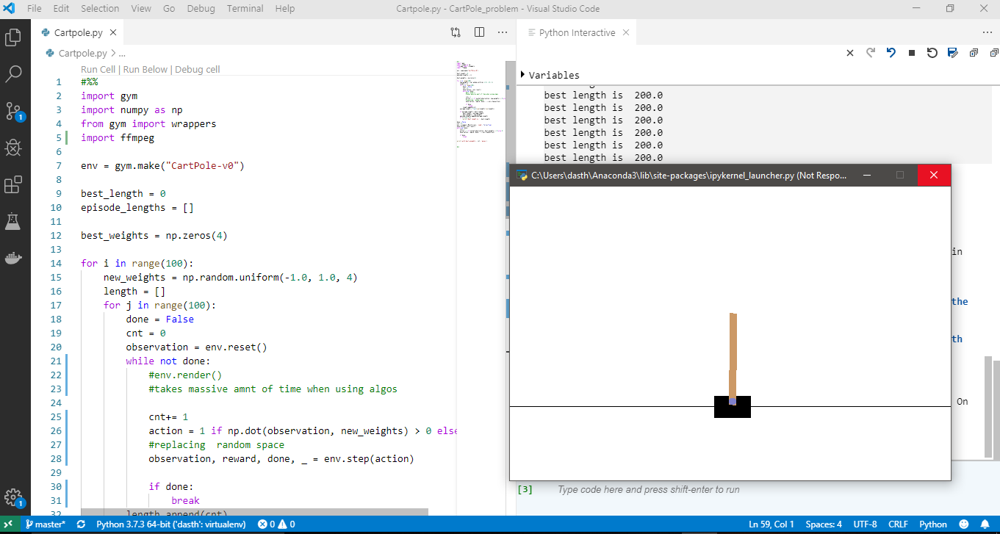

# CartPole_problem

CartPole problem with reinforcement learning.

A novel way to approach the Cartpole problem rather than using the random moves using Open AI Gym Lib. Instead of taking random moves along the x-axis which causes a shorter run time of the problem(max of 15 secs), I introduce a set of parameters to run this for greater amounts of time.

Moving right to left is decided by a set of parameters in my case and  runs 10,000 (100 sets of games) without rendering. Limit of 200 moves are accomplished in this process and significantly outperforms the random approach of decsison making.

